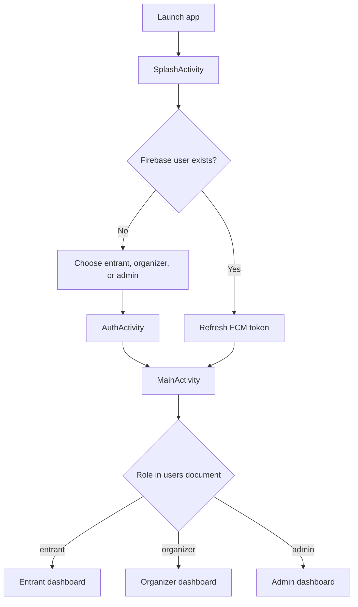
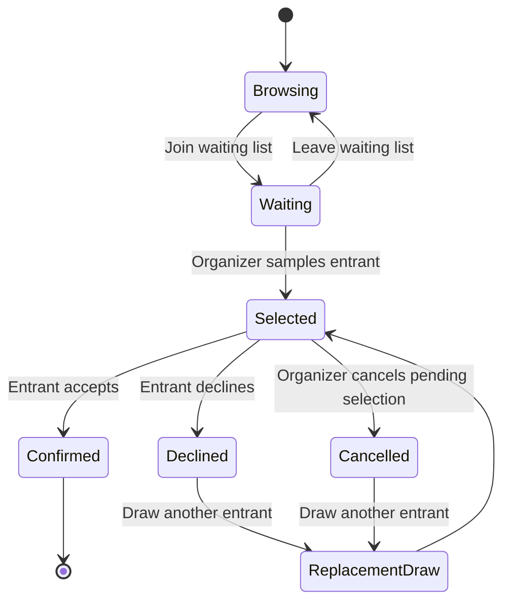
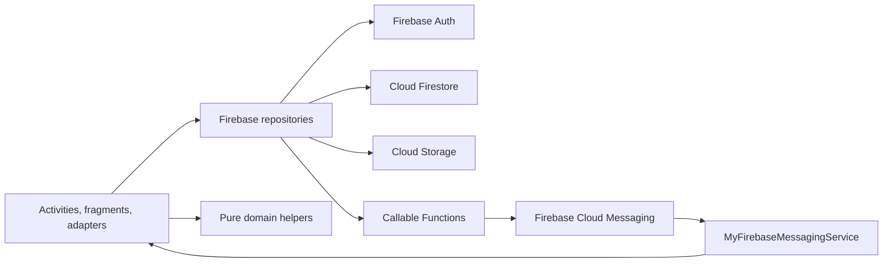

# Ticketjack

Ticketjack is a role-based Android event-registration app built around fair, lottery-style admission. Entrants join event waiting lists during a registration window; organizers randomly sample candidates, notify selected entrants, and draw replacements when someone declines; administrators can moderate events, users, organizers, images, and notification records.

The Android application is written in Java and uses Firebase Authentication, Cloud Firestore, Cloud Storage, Cloud Messaging, and callable Cloud Functions. The repository also contains the Node.js Cloud Functions that send batch notifications.

> **Project provenance:** this code was migrated and reorganized from the public [`CMPUT301F25binary1/binary1`](https://github.com/CMPUT301F25binary1/binary1) project. The original contributor list is retained in [`docs/team.txt`](docs/team.txt).

## What the app supports

### Entrants

- Register with an email and profile details using a persistent anonymous Firebase Auth account.
- Browse events whose registration window is currently open.
- Search by event name, filter by category, and show events happening today.
- Open an event directly by scanning its QR code.
- Join or leave a waiting list.
- Share the last known device location when an event requires geolocation.
- Review waiting-list and selection history.
- Accept or decline a lottery invitation.
- Edit profile details and notification preferences.
- Delete the current Firebase Auth account and Firestore profile.

### Organizers

- Register or sign in with email and password.
- Create events with registration dates, event date, category, guidelines, poster, optional waiting-list limit, and optional geolocation requirement.
- Edit events and replace posters.
- Generate an event QR code from the event identifier.
- View waiting, selected, cancelled, and confirmed entrant groups.
- View waiting-list locations on Google Maps.
- Randomly sample entrants and draw replacements.
- Send notifications to selected, waiting, or cancelled entrants.
- Export entrant lists as CSV.

### Administrators

- See live counts for events, users, organizers, and event posters.
- Browse and remove events.
- Browse and remove user profiles.
- Deactivate organizer profiles and their events.
- Review and remove uploaded event images.
- Review notification logs with date and event filters.

## Runtime flow



1. `SplashActivity` waits briefly, checks Firebase Authentication, refreshes the FCM token for an existing user, and routes to either role selection or the main app.
2. `RoleSelectionActivity` passes the selected role to `AuthActivity`.
3. Entrants use anonymous authentication; organizers and admins use email/password authentication.
4. Every successful registration creates `users/{uid}` in Firestore.
5. `MainActivity` reads the user document's `role` and loads the corresponding dashboard.
6. Entrant and organizer screens use a bottom navigation bar. Admin screens use a dashboard and fragment navigation.

## Event and lottery lifecycle



- Joining writes both `events/{eventId}/waitingList/{uid}` and `users/{uid}/eventHistory/{eventId}` in one Firestore batch.
- If geolocation is required, the waiting-list document also stores a Firestore `GeoPoint`.
- Sampling shuffles eligible waiting-list user IDs, creates `selected` documents, updates user history to `Selected`, and removes sampled users from `waitingList`.
- Accepting changes history to `Confirmed` and writes `confirmedAttendees/{uid}`.
- Declining changes history and selection status, then attempts to sample one replacement.
- Organizer cancellation records the entrant under `cancelled` and changes history to `Cancelled`.

## Architecture

The project uses a pragmatic activity/fragment + repository structure:



- **UI layer:** activities host role routing and fragment containers; fragments implement screens; RecyclerView adapters render lists and invoke repository operations.
- **Repository layer:** centralizes Firebase Auth, Firestore, Storage, callable Functions, admin image operations, and notification-log operations.
- **Domain layer:** contains Firebase-independent validation and invitation/waiting-list logic used by local unit tests.
- **Model layer:** Firestore-compatible POJOs such as `Event`, `User`, `Invitation`, and `NotificationLog`.
- **Service layer:** receives FCM messages, updates event history when a data payload contains a status, and creates Android notifications.
- **Cloud Functions:** trusted backend code reads Firestore recipient groups and sends FCM multicast messages.

### Source layout

```text
Ticketjack/
├── app/
│   └── src/
│       ├── main/
│       │   ├── java/com/example/fairchance/
│       │   │   ├── data/repository/   # Firebase-facing data access
│       │   │   ├── domain/            # Pure business rules and validators
│       │   │   ├── models/            # Firestore/domain POJOs
│       │   │   ├── service/           # FCM Android service
│       │   │   ├── ui/
│       │   │   │   ├── adapters/      # RecyclerView adapters
│       │   │   │   └── fragments/     # Entrant, organizer, and admin screens
│       │   │   └── util/              # CSV and text-watcher helpers
│       │   ├── res/                    # Layouts, drawables, menus, themes
│       │   └── AndroidManifest.xml
│       ├── test/                       # Local JVM tests
│       └── androidTest/                # Espresso/instrumentation tests
├── functions/                          # Firebase callable functions (Node.js)
├── gradle/                             # Version catalog and wrapper
├── docs/team.txt                       # Original contributor list
├── firebase.json                       # Firebase Functions deployment config
├── .firebaserc                         # Default Firebase project alias
└── local.properties.example            # Local SDK and Maps configuration
```

The Java namespace and Android application ID remain `com.example.fairchance` so the included Firebase Android client configuration continues to match the registered app. The user-visible app name and Gradle root project name are `Ticketjack`.

## Technology stack

### Android

- Java 11 source compatibility
- Android Gradle Plugin 8.13 and Gradle 8.13
- Minimum SDK 24; compile and target SDK 36
- AndroidX AppCompat, Activity, ConstraintLayout, CardView, Navigation, Fragment Testing
- Material Components
- Glide for remote poster images
- ZXing and JourneyApps embedded scanner for QR generation/scanning
- Google Play Services Maps and Location

### Firebase

- Firebase Android BoM 34.5
- Authentication: anonymous and email/password
- Cloud Firestore: application data and real-time listeners
- Cloud Storage: event posters
- Cloud Messaging: device push notifications
- Cloud Functions: callable notification fan-out
- Analytics

### Cloud Functions

- Node.js 22
- `firebase-functions` 7.x
- `firebase-admin` 14.x

### Testing

- JUnit 4 through the JUnit Platform vintage engine
- Mockito and Robolectric for local tests
- AndroidX Test, Espresso, Espresso Intents, and Mockito Android for instrumentation tests

## Firestore data model

The following tree reflects the collection paths used by the current code:

```text
users/{uid}
├── email, name, phone, role
├── fcmToken
├── notificationPreferences
│   ├── lotteryResults
│   └── organizerUpdates
├── isActive / roleActive / deactivation metadata
└── eventHistory/{eventId}
    ├── eventName
    ├── eventDate
    ├── status
    └── updatedAt

events/{eventId}
├── organizerId
├── name, description, category, guidelines, location
├── registrationStart, registrationEnd, eventDate
├── capacity, price, waitingListLimit, geolocationRequired
├── posterImageUrl and upload metadata
├── createdAt / timeCreated and creator metadata
├── waitingList/{uid}
│   ├── joinedAt
│   └── location (optional GeoPoint)
├── selected/{uid}
│   ├── status
│   ├── sampledAt / notifiedAt
│   └── replacementDrawn
├── confirmedAttendees/{uid}
│   └── confirmedAt
├── cancelled/{uid}
│   ├── cancelledAt
│   └── reason
└── notificationLogs/{logId}

notificationLogs/{logId}
adminRemovalLogs/{logId}
organizerDeactivationLogs/{logId}
imageRemovalLogs/{logId}
```

The app currently uses both top-level `notificationLogs` for the admin audit UI and event-scoped notification logs written by two Cloud Functions. If notification auditing is expanded, these should be consolidated into one canonical schema.

## Push notifications

`functions/index.js` exports three callable functions:

- `sendChosenNotifications`: sends to all eligible `selected` documents or one selected entrant, then marks selection documents as notified.
- `sendWaitingListNotifications`: sends an organizer message to the waiting list and writes an event-scoped log.
- `sendCancelledNotifications`: sends an organizer message to cancelled entrants and writes an event-scoped log.

Each function:

1. Validates `eventId`.
2. Loads the event and target subcollection.
3. Loads each target user's notification preferences and FCM token.
4. Sends one multicast FCM request for available tokens.
5. Returns `{ sentCount, failureCount }`.

The Android `MyFirebaseMessagingService` handles foreground/data messages, builds an Android notification channel, and can route a selected entrant directly to the Invitations screen.

## Prerequisites

- Android Studio with Android SDK 36, or the equivalent command-line SDK
- JDK 17
- Node.js 22 for Cloud Functions
- A Firebase project with Authentication, Firestore, Storage, Messaging, and Functions enabled
- A Google Maps SDK for Android API key for the waiting-list map
- Firebase CLI if deploying or running Functions emulators

## Fresh-clone setup

### 1. Clone

```bash
git clone https://github.com/Aaryan-MK7/Ticketjack.git
cd Ticketjack
```

### 2. Configure the Android SDK and Maps key

```bash
cp local.properties.example local.properties
```

Edit `local.properties`:

```properties
sdk.dir=/absolute/path/to/Android/sdk
MAPS_API_KEY=your_restricted_google_maps_api_key
```

`local.properties` is ignored by Git. `MAPS_API_KEY` can instead be supplied as an environment variable. The project builds without a Maps key, but the map screen will not load map tiles.

Restrict the key in Google Cloud Console to:

- Android apps
- package `com.example.fairchance`
- the SHA-1 fingerprints of approved debug/release signing certificates
- Maps SDK for Android only

### 3. Configure Firebase

The repository includes `app/google-services.json` and `.firebaserc` for the original Firebase project so the checked-in client can compile. Backend access still depends on that project's active services, rules, data, authorized signing certificates, and your permissions.

For a separate Firebase project:

1. Create an Android app with package `com.example.fairchance`.
2. Replace `app/google-services.json`.
3. Update `.firebaserc` with the new project ID.
4. Enable anonymous authentication and email/password authentication.
5. Create Firestore and Storage.
6. Deploy appropriate Firestore and Storage security rules.
7. Deploy the functions from this repository.
8. Add the required Firestore indexes when Firebase surfaces an index link for compound queries.

### 4. Build the Android app

```bash
./gradlew clean assembleDebug
```

The debug APK is generated at `app/build/outputs/apk/debug/app-debug.apk`.

To install on a connected emulator or device:

```bash
./gradlew installDebug
```

### 5. Install Cloud Functions dependencies

```bash
npm ci --prefix functions
npm test --prefix functions
```

## Development commands

### Android

```bash
# Local JVM tests
./gradlew testDebugUnitTest

# Android static analysis
./gradlew lintDebug

# Debug APK
./gradlew assembleDebug

# Instrumentation/UI tests; requires a running emulator or connected device
./gradlew connectedDebugAndroidTest
```

### Cloud Functions

```bash
# Reproducible install
npm ci --prefix functions

# JavaScript syntax validation
npm test --prefix functions

# Production dependency audit
npm audit --prefix functions --omit=dev

# Local Functions emulator
npm run serve --prefix functions

# Deploy callable functions
npm run deploy --prefix functions
```

## Validation performed for this migration

The reorganized repository was validated on macOS with JDK 17, Android SDK 36, and Node.js 22:

- `./gradlew testDebugUnitTest assembleDebug` — 33 tests passed, 0 failed
- `./gradlew lintDebug` — passed with 0 errors; non-blocking modernization/accessibility warnings remain
- `npm test --prefix functions` — JavaScript syntax passed
- `npm audit --prefix functions --omit=dev` — zero known vulnerabilities after dependency upgrades
- Debug APK generation — passed

Instrumentation tests require an Android emulator or physical device. They should be run with `connectedDebugAndroidTest` before a release; they are not equivalent to local JVM tests.

## Test organization

- `app/src/test`: models, CSV export, event validation, invitation state, and waiting-list logic.
- `app/src/androidTest`: repository/Firebase integration checks plus UI flows for splash, role selection, authentication, entrant dashboard, organizer dashboard, events, invitations, history, profiles, and waiting lists.

Some instrumentation tests interact with Firebase. Run them only against a dedicated test project or emulator setup, not production data.

## Security and production-readiness notes

This repository builds and its local checks pass, but the current application architecture should not be treated as production-secure without backend hardening:

- Firestore and Storage rules are not included. Client-side role checks are not an authorization boundary.
- The client currently exposes organizer/admin registration and writes the chosen role to Firestore. A production system must assign privileged roles from a trusted backend or custom claims.
- Callable notification functions currently validate inputs but do not enforce organizer/admin authorization. Add authentication and ownership checks before public deployment.
- Entrants use anonymous authentication. Clearing app data or changing devices can make that account inaccessible unless an account-linking flow is added.
- The organizer dashboard's standalone “Lottery” shortcut is not wired; sampling is available from an individual event's details screen.
- Event deletion removes only the subcollections explicitly listed by the repository. Additional subcollections must be included or deleted by a trusted backend.
- Firebase client config is not a server secret, but all API keys should still be application-restricted and Firebase rules must protect data.

## Troubleshooting

### `Unable to locate a Java Runtime`

Install JDK 17 and point Gradle to it:

```bash
export JAVA_HOME=$(/usr/libexec/java_home -v 17)
```

### Android SDK not found

Set `sdk.dir` in `local.properties` or export `ANDROID_HOME`.

### Map is blank

Confirm `MAPS_API_KEY` is set, Maps SDK for Android is enabled, billing is active if required, and the package/SHA-1 restrictions match the installed APK.

### Firebase authentication or Firestore requests fail

Verify that:

- `app/google-services.json` belongs to the intended project and package.
- anonymous and email/password providers are enabled.
- Firestore/Storage rules permit the expected operation.
- required compound indexes exist.
- the device has network access.

### Callable Function is not found

Deploy the functions to the same Firebase project referenced by the Android client:

```bash
npm run deploy --prefix functions
```

If functions are deployed outside the default region, configure the Android `FirebaseFunctions` instance with that region.

## Attribution

The migrated source originated in the CMPUT 301 Fall 2025 Binary 1 project. Original contributors are listed in [`docs/team.txt`](docs/team.txt). No license file was present in the source repository; add an explicit license before distributing or accepting third-party contributions.
